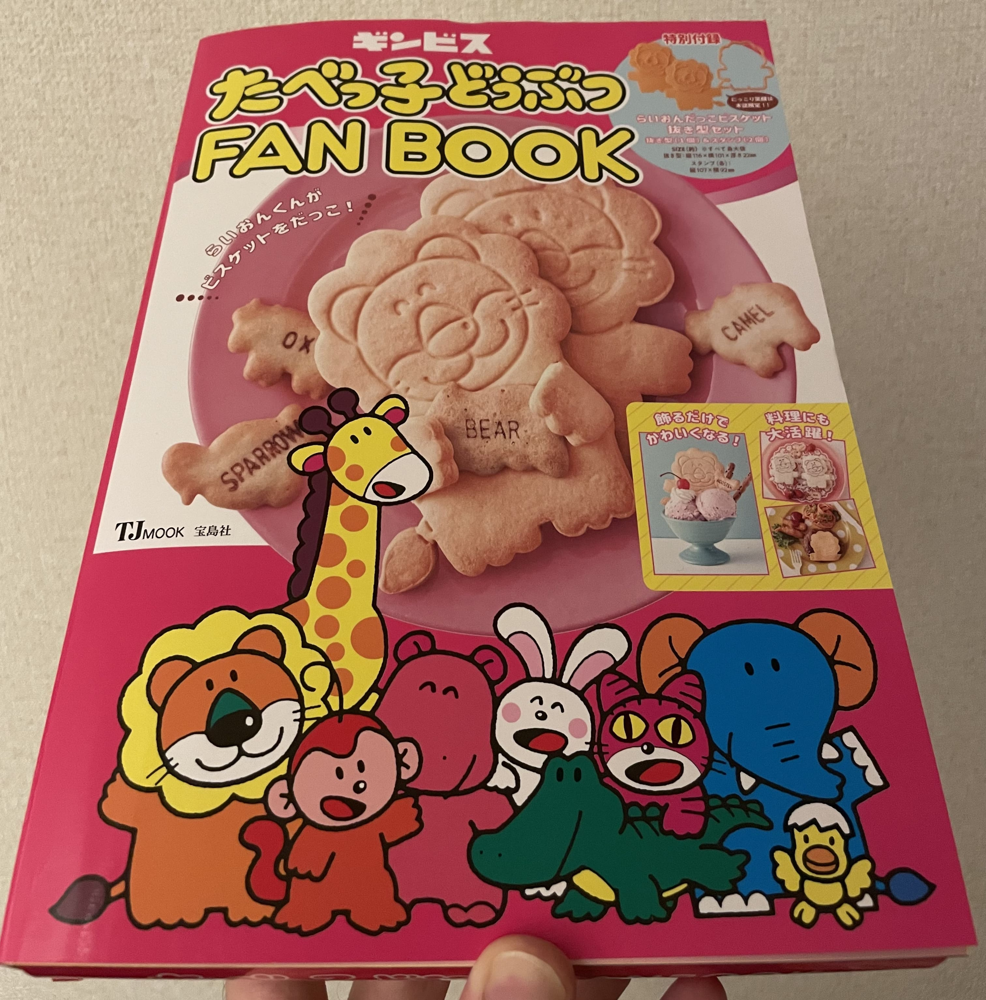
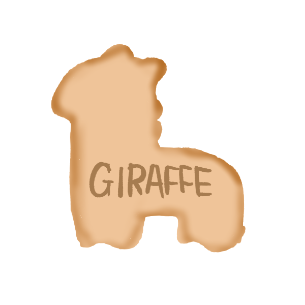

たべっ子どうぶつ大好きのどうも僕です。

たべっ子どうぶつのガチャガチャが出れば、かなりのお金をつぎ込んで回しますし、
一番くじがきたら引きますし、お菓子も勿論好きです。

そして先日（2021/5/24）発売した、たべっ子どうぶつFAN BOOKを息を吸うように購入しました。

この本というか冊子の中に、驚くべき事実が書かれていました。
5ページ目を参照していただきたいのですが、

> 現在発売されている箱にいるキリンやワニは、首やしっぽが欠けてしまうため製品化できていない。

とのことです。

##### **そうだったの！！！？？？**

そこで考えました。

現在たべっ子どうぶつでは、たくさんの動物がビスケット化されていますが、ぱっと見て、その形から
なんの動物か答えるのが難しいものも多々あると思っています。

であるならば、ある程度首やしっぽの問題を回避しつつ、他の動物の型のようにデザインすることは
できるのではないかと思い自分なりにデザインしてみた。

そして他の動物ビスケットを参考にして、私なりに考えたのが下記です。

ワニのビスケットはこちら

キリンのビスケットはこちら

##### **いかがですか！！！！！！！！ギンビスさん！！！**

お菓子の製造工程とか、ビスケットの生地面積の制約とか、その他もろもろの縛りを知らない人間が
勝手にデザインして、わかってないなと思われてしまうかもしれませんが、
他のビスケットを参考にこれくらいならワンチャンいけるんじゃないかと思ったんですが。

どうかパッケージに載っているキリンさんとワニさんも仲間にいれてもらえたら幸いです。

よろしくおねがいします。

