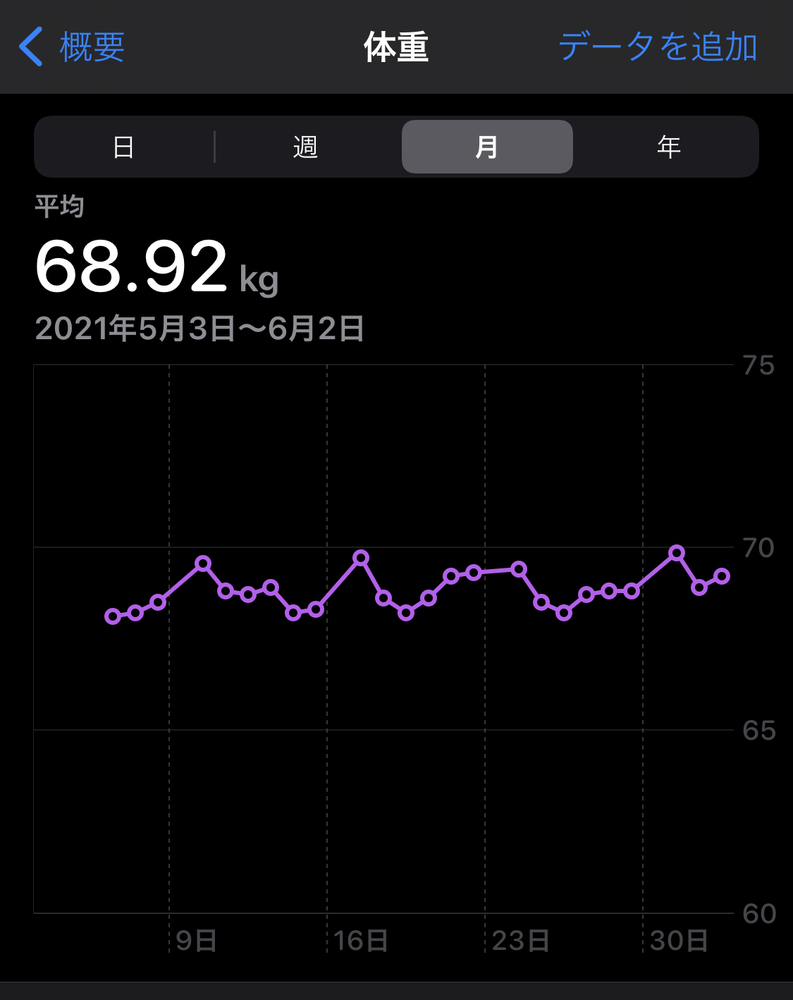

以前、[体重計を買いました](/blog/weight_scale/)という記事を書きました。
１ヶ月近く使っていますが、特になんの問題もなかったので良い体重計でした。

その後、毎日体重を測っていて、どんどんとappleのヘルスケアアプリにデータがたまっております。
下図を参照ください。

あれ、、なんか微妙に上昇傾向じゃないかという見方もありますが、たぶん目の錯覚です。
ちなみに体脂肪率も連携していますが、同じようなグラフになっています。

そもそもダイエットしてたっけ？という話ですが下記のようなことをやっています。

## ダイエットと称してやっていること

1. 毎朝、毎晩に近所を散歩（片道約２０分）
2. 平日、リングフィットアドベンチャーを約３０分
3. 食事をすべてスプレッドシートに記載（制限はしていない）

まあ、上記すべて、やらないよりは良いでしょうということでやっています。
それぞれについて軽く触れてみます。

### 🏃毎朝、毎晩に近所を散歩（片道約２０分）

仕事を始める前と終わったあとに散歩します。
これは、かなり仕事の切替に一役買っている気がします。
最近はリモート勤務なので、少しは歩かないとなあという感じです。

### 💪平日、リングフィットアドベンチャーを約３０分

結構継続していて、ストーリーモードで現在レベル130を超えました。
好きなスキルは、スワイショウ。（楽だから）
嫌いなスキルは、ワイドスクワット。（疲れるから）

### 🍔食事をすべてスプレッドシートに記載（制限はしていない）

今年の３月くらいから毎日食べたものを記録しています。
記録してるだけなのですが、とりあえずこんなに食べてるなら、明日太るだろうなあという気持ちになれるのでおすすめです。

## 総評

ダイエットやってる風に書いてますが、冒頭で載せた体重グラフが現実です。
痩せていません。なんなら少し太り気味です。
現実は非情ですが、今日も元気です。

ありがとうございました。

