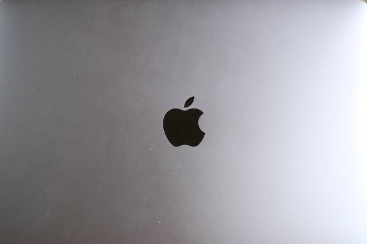
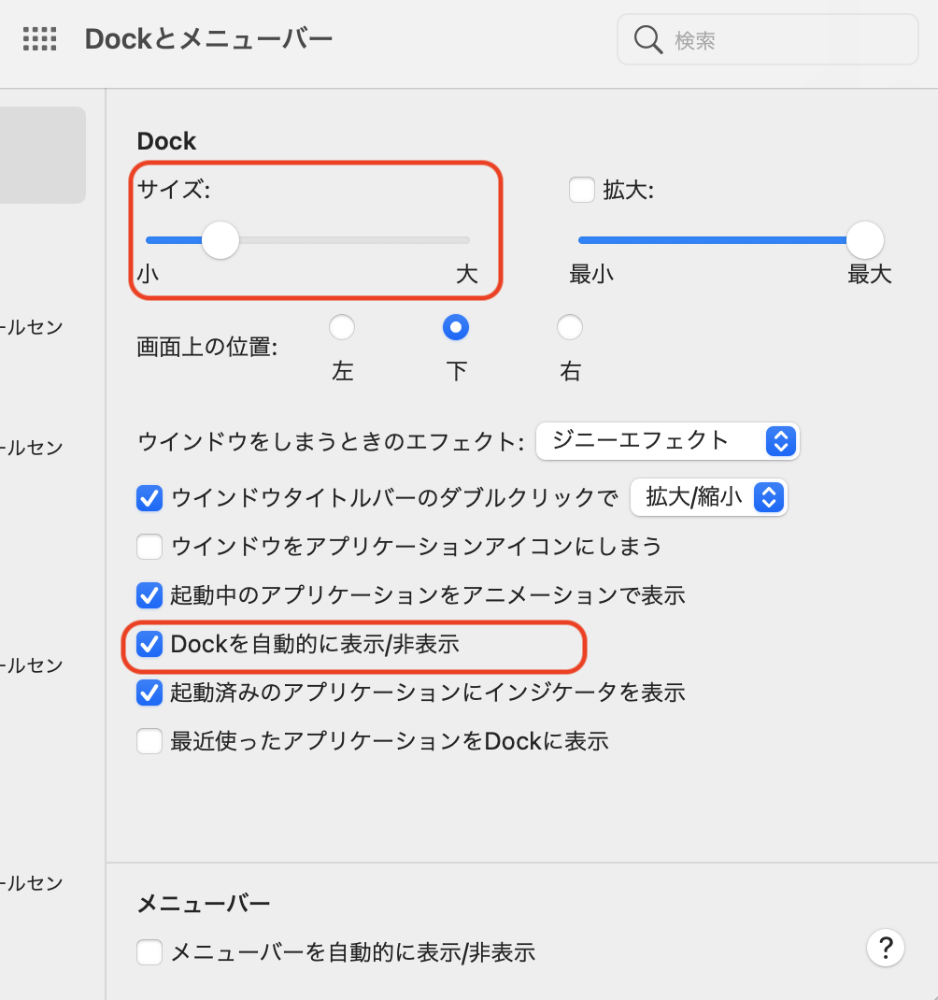
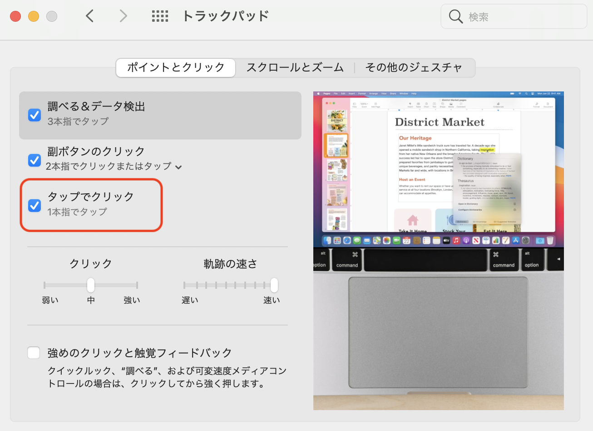
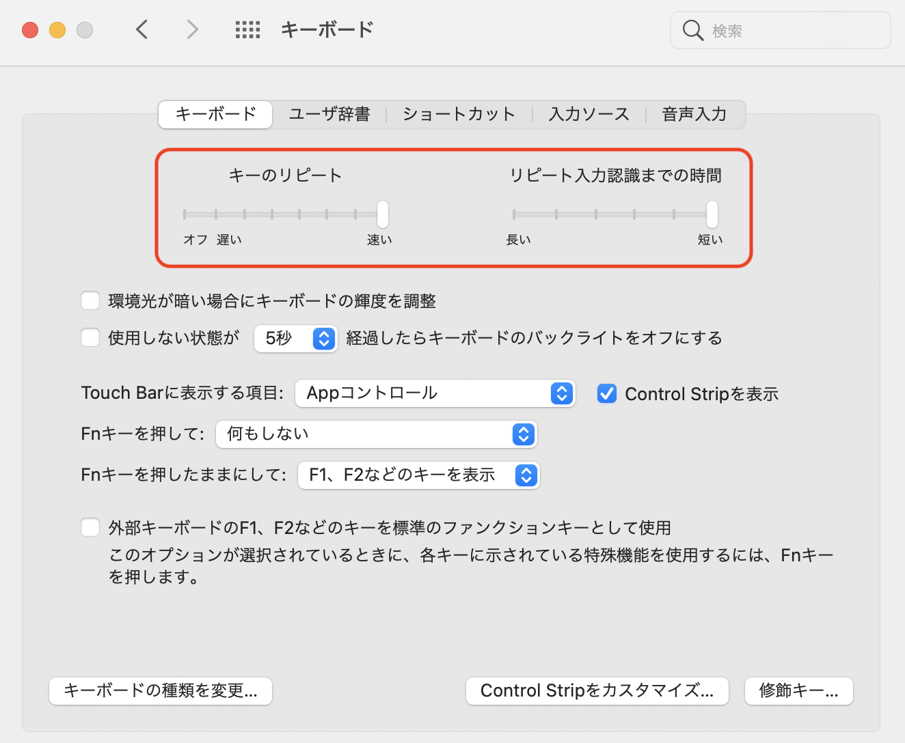
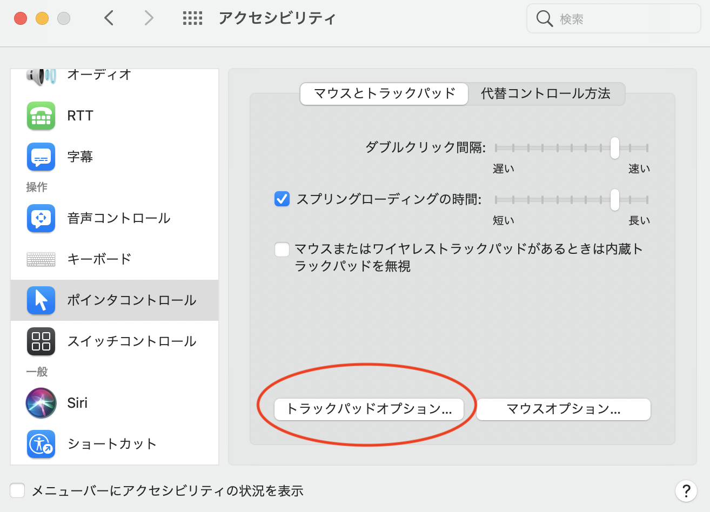
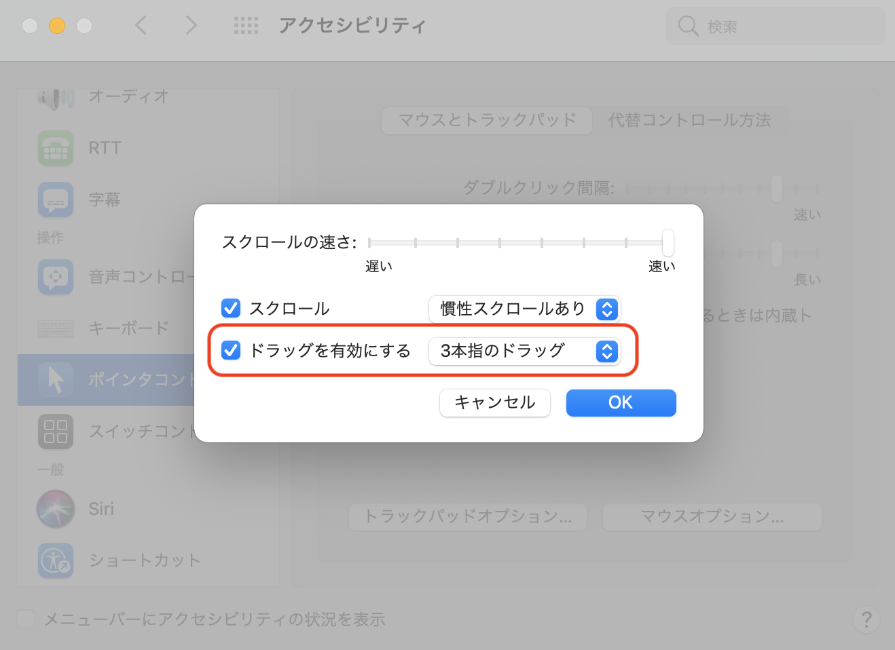

私がMacを使い始めたのは大学生の頃からなので少なくとも１０年以上Macを使っています。

Macを購入して必ず最初に行う設定変更を紹介します。

結局は慣れの問題かもしれませんので、お好みに合わせて適用してください。

(説明画像のOSバージョンは、BigSurですが、それより古いバージョンもだいたい同じだと思います。)

## Macで初期設定から変更する項目

1. Dockを自動的に表示・非表示にする
2. トラックパッドをタップでクリック可能にする
3. キーボードのリピート速度をmax早くする
4. トラックパッドのドラッグ操作を３本指にする

それでは上記を順番に説明します。

### 1. Dockを自動的に表示・非表示にする

設定＞Dockとメニューバー

- サイズは小さ目にします
- 「Dockを自動的に表示/非表示」にチェックを入れる。

これで広く画面を使えて良きです。
ちなみに長年Dockの位置はどこが最適か考えていたのですが下が一番おすすめです。

### 2. トラックパッドをタップでクリック可能にする

設定＞トラックパッド

- 「タップでクリック」にチェックを入れる。
- 軌跡の速さもmaxまで早くします。

タップするのにトラックパッドを押し込む力が要らなくなります。

### 3. キーボードのリピート速度をmax早くする

設定＞キーボード

- 「キーのリピート」,「リピート入力認識までの時間」をmaxまで早くします。

これで、タイピングのもたつきはなくなりますよね。

### 4. トラックパッドのドラッグ操作を３本指にする

設定＞アクセシビリティ＞ポインタコントール

「トラックパッドオプション」を開きます。

- 「ドラッグを有効にする」にチェックを入れて、「3本指のドラッグ」にします。
- スクロールの速さも一番早くしておきます。

これで、トラックパッドを押し込まなくてもドラッグが３本指でできるようになります。

## まとめ

上記４つをやっていないMacを触るとぴよぴよってなります。

初期状態でも問題ない人はそれが一番良いとは思います。
自分は、このように効率化を行うために制約が増えているのです。

