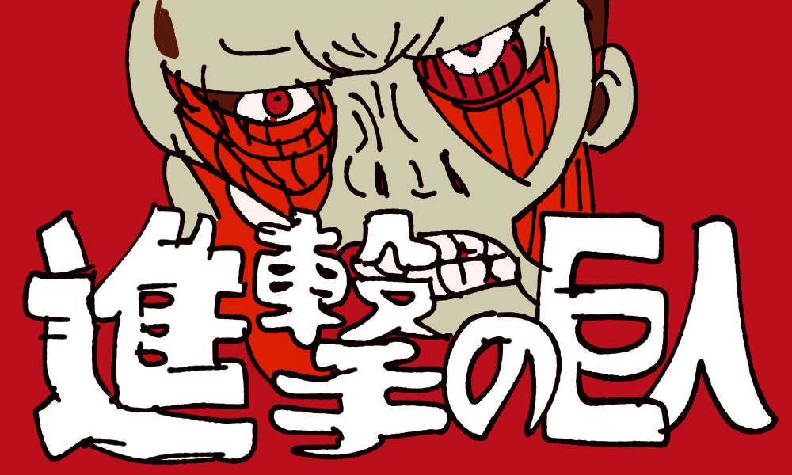
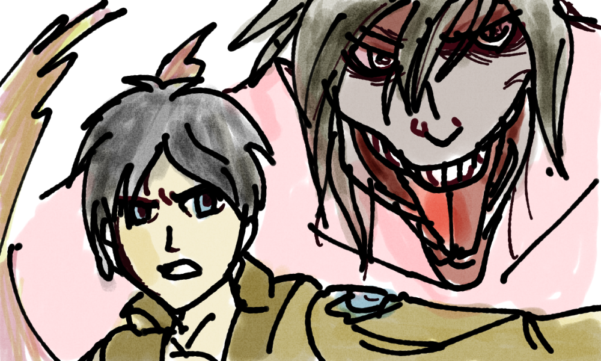

（紅蓮の弓矢を聞きながら絵を描きました。ちょっと怖いね）

## 前置き

私が進撃の巨人を最初に触れたのは第一巻の単行本が出たころだったので大学生のころだったと思う。
もうかれこれ１０年以上前だ。
その間、特に進撃の巨人については触れずに過ごしてきた。
それがとうとう完結したということで一気読みした。

最初の３巻くらい読んだところで、こんなに展開早くて大丈夫？って心配しちゃった。
こんなに物語が積上があっていたこと驚いたし、１０年の重みにビビった。

余談だが、作者が同じ大分県出身ということで当時へえーとなった覚えがある。

## 感想

巨人やそれを防衛する壁という舞台装置や、数々の伏線が巧妙であり、続きが気になる展開が面白かった。
ストーリー以外で特に良かったポイントは下記２つです。

1. 真面目なシーンに不意にギャグを入れてくるところ。
2. 結構重要な事実をさらっと話に織り交ぜる技巧。

1に関しては、生と死の重い話が続くなかに、唐突にギャグがまじってくるのに驚きが隠せず笑ってしまうし、
なんかシュールさがちょうど良い。

2に関しては、ライナーとベルトルトの衝撃の告白シーンでそう思った。さらっとすごいこと言わせる演出がかっこいい。

## めちゃ終盤のネタバレと思ったこと

### 巨人の能力について

エレンは、始祖の巨人の力と進撃の巨人の力によって、未来や過去を超越して巨人とかを操作できたわけだが、ちょっとこの能力がチートである。

未来のエレンが過去のベルトルトを救ってあえて母親を殺すように仕向けたということが示されたけど、
であれば、もっと良い形に未来を変えることができたのではないかと思わずにはいられない。

### エレンは身近な人間のためなら犠牲を顧みない

エレンは幼少期、ミカサを助けるために襲ってきた誘拐犯を殺している。

身の回りの人間のためには、他者を虐げることができる。
最終的にエレンは、全人類を８割滅ぼす選択もとった。

ここで頭によぎるのは、トロッコ問題という有名な倫理学の問題である。

「ある人を助けるために他の人を犠牲にするのは許されるか？」

エレンは生と死の過酷な状況下において常に選択を迫られる。
リヴァイ兵長もエレンに下記のようなことを告げる。

> エレン お前は間違っていない
> やりたきゃやれ。 俺には分からない
> ずっとそうだ…。自分の力を信じても… 信頼に足る仲間の選択を信じても…
> 結果は誰にも分からなかった…
> だから… まぁせいぜい… 悔いが残らない方を自分で選べ
>
> 引用：「進撃の巨人」リヴァイ

そういう意味ではエレンはしっかり選択した。

ハンターハンターのドキドキ２択クイズというものがある。

母親か恋人どちらか一方しか助けられないならどちらを助けるか？
答えは沈黙であることはあまりに有名であるが、
エレンたちは沈黙ではいられない。

つねに命の選択がこの物語では行われる。誰を助ける？非情に難儀だ。

（エレンのつもりで描いたよ）

## まとめ

終盤は、カタルシスを最大化するためやや無茶な展開があった雰囲気は否めないが、
この結末に対しては特に負の感情はない。
物語の終わりを見届けられてほっとしたという感じである。
あと、リヴァイ兵長が人気な理由をなんとなく理解した。

約１２年間も人々を魅了する物語を書き続けしっかりと幕引きをするということ自体が
天才の所業だと思うし、本当に作者すごいなあ。

結論名作。

## 追伸

ウォール・マリアとかって、巨人がきれいに整列して硬質化したの想像するとちょっとおもしろいなって思った。
