このomomuro.devブログはGatsby.jsで作られています。
このブログを作る上で学んだことなどを備忘録としてまとめておきます。
下記がトピックとなります。

1. ブログを作る意義 💪
2. Gatsby.jsを選んだ理由 💘
3. ドメインを取得する 💸
4. AWSでサイトを公開する方法 💻
5. Gatsby.jsでのblog作成方法 🍦
6. Github Actionで、blogをS3にデプロイ 🐻
7. まとめ　📖

## ブログを作る意義 💪

あまり、ないです。
今どきnote.comとか、はてなブログとかあるし、
あえて自作する意味はたぶんあまりない。

自分の動機は下記です。

- AWSの勉強しよう。
- ひとまず、S3でなんかサイト公開してみよう。
- ポートフォリオ的なのも作ってみたいなあ。
- フロントエンドの実験的なことをして公開したい。
- 強いエンジニアはブログやりがちだし真似してみるか。

という軽いノリで始めたので、しいていうなら意義はロマンです。

## Gatsby.jsを選んだ理由 💘

まず前提としてサーバーレスでやりたかった。
理由は、なんかサーバーを動かすと面倒だから（エンジニアとして大丈夫か？）

ということで、Railsとかサーバーサイドが必要な技術は除外した。

そして、自分が知っているReactやVueで出来るやつにしようと思った。
Reactの方がなんとなく好きなので、Next.jsかGatsby.jsに絞った。

Next.jsはVercelというホスティングありきな感じが強かったので、
最終的には、Gatsby.jsを選んだ。（GastsbyもGastby Cloudとかあるけど。。。）

あと、ついでにGatsby.jsは、GraphQLを使うので、ついでにGraphQLも学んでおくかという感じでした。

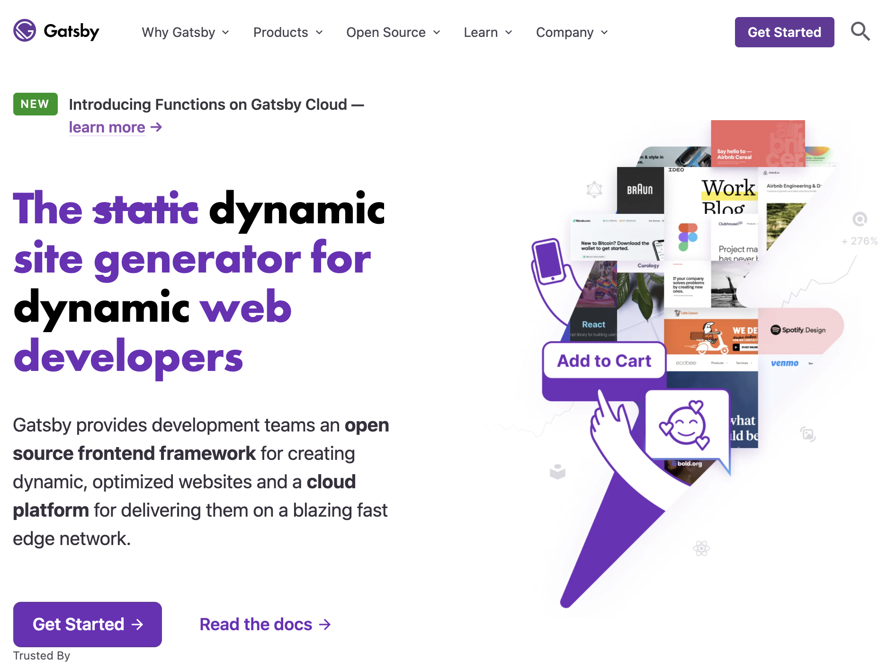
Gatsby.js公式サイトのスクリーンショット

## ドメインを取得する 💸

このブログのドメインは「omomuro.dev」です。

ドメインをどこで取得するか？

お名前.comとかあるけど、今回はGoogle Domainsにしてみた。
（昔、お名前.com使ったことがあったが、更新の催促メールが尋常じゃなくうざかったので。。）

Google DomainsはUIがスッキリしていて、ドメインの検索もしやすいし、結構おすすめです。

メリットとして、Google Search Consoleを使う際、Google同士なのでサービスが連携していて、ドメインの保持証明が楽だった。


google domainsのスクリーンショット

ドメインは、短くて覚えやすそうなものほど高いです。
「omomuro.dev」は年間1500円くらいでした。

ドメインを取得したら、AWSの「Route 53」で確認できるネームサーバーを登録しておきましょう。

## AWSでサイトを公開する方法 💻

まずはAWSのアカウントを作っちゃいましょう。

AWSで使用したサービスは下記です。

- Route 53
- S3
- Cloud Front
- Lambda

### Route 53

google domainsで取得したドメインを設定しますが、
後述するCloud Frontにて、もろもろいい感じに設定できたと思います（うるおぼえ。。）

### S3

まずは、バケットを新規作成しましょう。
「このバケットのブロックパブリックアクセス設定」にある「すべてブロック」のチェックボックスを全部解除しましょう。

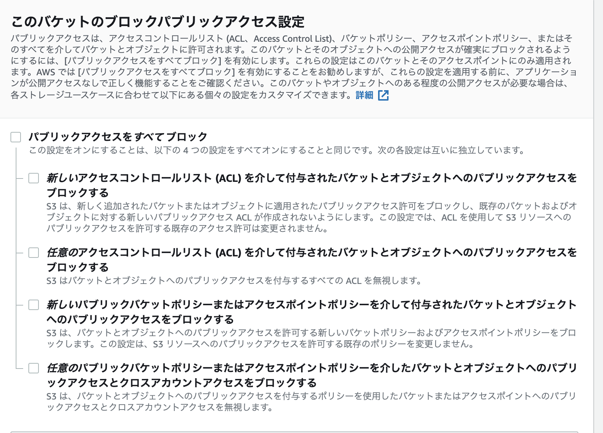

あとの細かい設定はデフォルトでいいです。

### CloudFront

AWSのCDNです。S3のhtmlファイルやリソースを高速に転送してくれます。
Route 53との連携も簡単なので良いです。

各種設定は、下図を参考にしてください。
#### 「General」

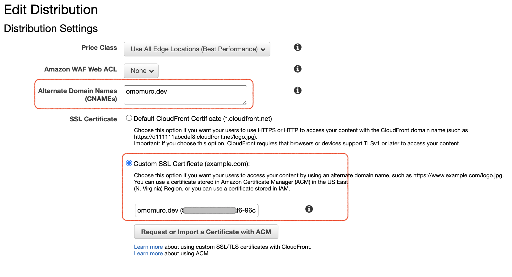
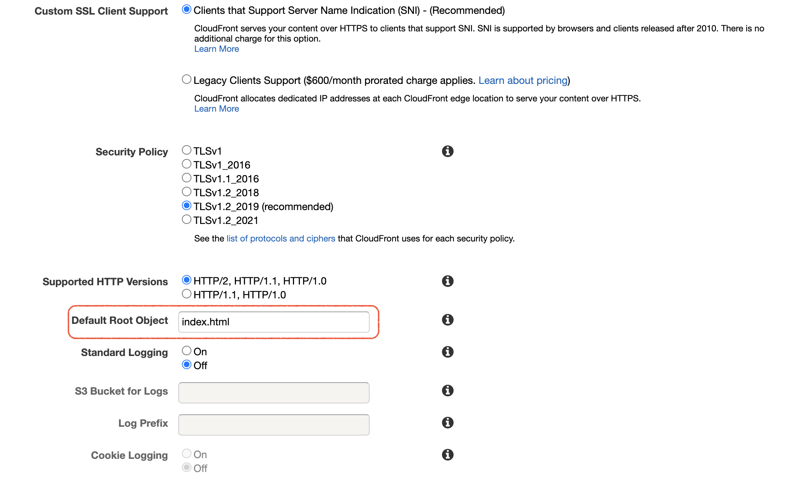

ここの「Custom SSL Certificate」にて、SSL証明書の発行とかができた記憶があります。
Routes 53との連携もここでいい感じにできた気がします。

#### 「Origins」

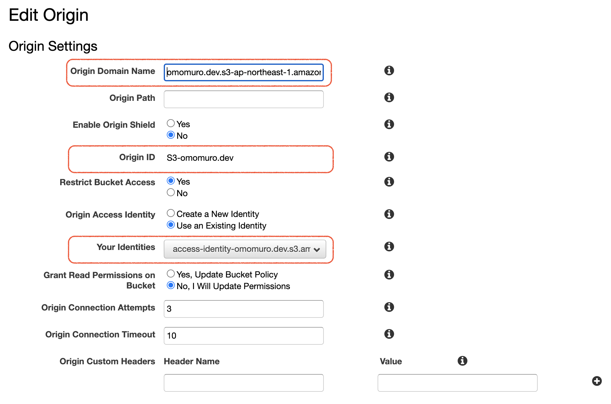

ここのOriginで事前に作成していたS3のバケットを指定しましょう。

#### 「Behaviors」

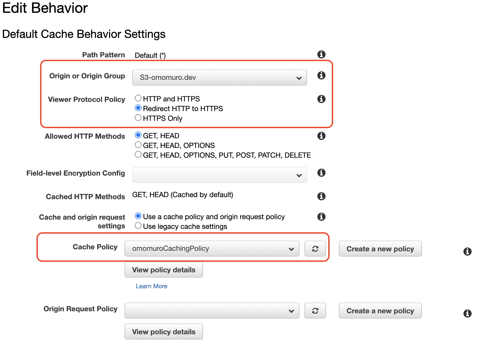
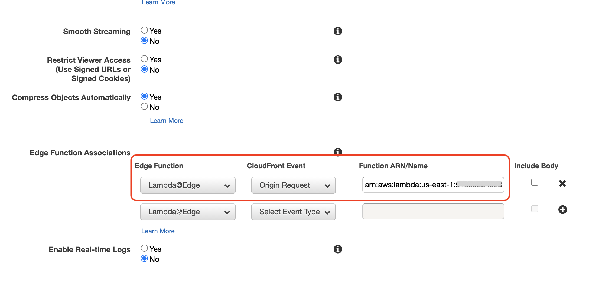

Edge Functionは後述するLambda@Edgeで作ったものを設定してあげます。

#### 「Error Pages」

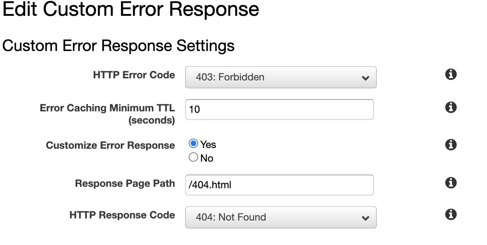

ここで404.htmlを返せるように設定します。

### Lambda@Edge

なんでLambda@Edgeが必要になるかと言うと、
まず、前提としてGatsbyが生成するHTMLファイルは下記のようになる。

```
/blog_slug/index.html
```

Gatsbyは上記ブログにアクセスする場合、基本index.htmlまでは入力せず、`/blog_slug/`だけでアクセスします。

CloudFrontで`/blog_slug/`とURLを直打ちすると、index.htmlを認識できず404エラーになってしまいます。
そこで、CloudFrontの機能のLambda@Edgeを使い、アクセスされたURLをもとに適宜index.htmlを返せるようにします。

Lambda@Edgeは、「米国東部 (バージニア北部)us-east-1」しか対応してないので注意。

下記が実際に使っているコードです。

```js:title=index.js
'use strict';
exports.handler = (event, context, callback) => {

    // Extract the request from the CloudFront event that is sent to Lambda@Edge
    var request = event.Records[0].cf.request;

    var olduri = request.uri;
    var newuri = request.uri;

    if (olduri.endsWith('/')) {
        newuri += 'index.html';
    } else if (!olduri.includes('.')) {
        newuri += '/index.html';
    }

    // Log the URI as received by CloudFront and the new URI to be used to fetch from origin
    console.log("Old URI: " + olduri);
    console.log("New URI: " + newuri);

    // Replace the received URI with the URI that includes the index page
    request.uri = newuri;

    // Return to CloudFront
    return callback(null, request);
};
```
参考：　https://hackerrdave.com/aws-lambda-edge-gatsby/

## Gatsby.jsでのblog作成方法 🍦

公式の「[gatsby-starter-blog](https://www.gatsbyjs.com/starters/gatsbyjs/gatsby-starter-blog)」をもとにして作りましょう。

```
gatsby new my-gatsby-project https://github.com/gatsbyjs/gatsby-starter-blog
```

いきなりもうテンプレ的にブログができているので、下記実行後`localhost:8000`にアクセスするともうひとまず動作を確認できます。

```
gatsby develop
```

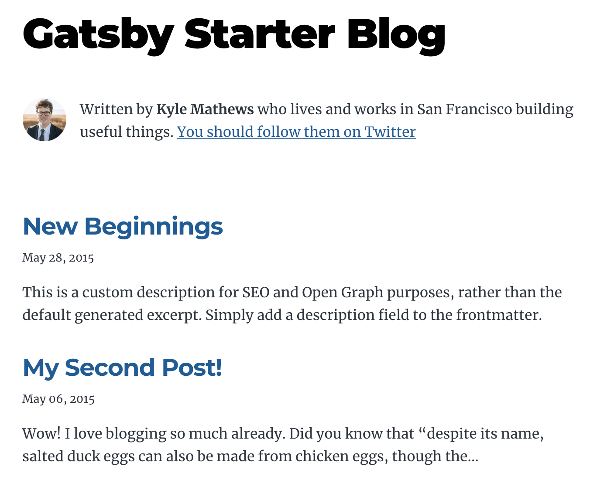

さらに、`localhost:8000/___graphql`にアクセスすると、もうGraphQLのqueryを実行できるようになっています。

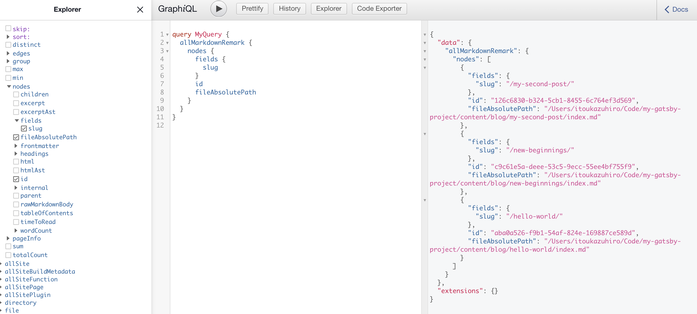

### ブログのデータソースをどこにするのか問題

私は当初、外部のHeadlessCMSを呼び出して作成していました。
使ったのは日本製の「Micro CMS」です。

使っていて、有料でないとできない制約が今後邪魔になりそうだなあと思ったのと、
そもそも、１人で運用するなら、ローカルでmarkdown書いてそれを読み込ませれば良いと判断しました。

複数人、特にエンジニアでない人が記事を書くなら、HeadlessCMSを使うと思います。
また、アプリが必要で、APIで記事を引っ張りたいならやはりHeadlessCMSを使うと思います。

ひとまずは、ローカルで作成することとしました。

もし、HeadlessCMSをつかうなら、prismicを使うかなあと思います。
https://prismic.io/

### おすすめのプラグイン

- gatsby-plugin-google-gtag・・・googleアナリティクスに対応したいため
- gatsby-plugin-s3・・・s3にデプロイするときのため
- gatsby-plugin-sass・・・sassを使いたい場合
- gatsby-plugin-use-dark-mode・・・darkmodeを導入したい場合
- gatsby-remark-external-links・・・外部リンクの場合target: blankにしてくれる
- gatsby-remark-prismjs・・・markdown本文中のcodeをシンタックスハイライトする
- gatsby-remark-prismjs-title・・・上記のcodeのタイトル欄を設けるため

### テンプレブログからカスタマイズする上で結構大事なこと

rootディレクトリ配下にある`gatsby-node.js`は結構大事です。

ここは何をしているかというと、
`gatsby develop`したときに呼ばれるもので、markdownファイルから動的にページを生成したり
GraphQLで利用したいフィールドの設定などができます。

私が作った例は下記です。

```js:title=gatsby-node.js
const createBlogPages = require("./gatsby_config/create_blog_page.js")
const createWorksPages = require("./gatsby_config/create_works_page.js")
const createTagPages = require("./gatsby_config/create_tag_page.js")
const createCategoryPages = require("./gatsby_config/create_category_page.js")
const { createFilePath } = require(`gatsby-source-filesystem`)

exports.createPages = async ({ graphql, actions, reporter }) => {
  await createBlogPages(graphql, actions, reporter)
  await createWorksPages(graphql, actions, reporter)
  await createTagPages(graphql, actions, reporter)
  await createCategoryPages(graphql, actions, reporter)
}

exports.onCreateNode = ({ node, actions, getNode }) => {
  const { createNodeField } = actions

  if (node.internal.type === `MarkdownRemark`) {
    const slug = `/${getNode(node.parent).name}/`
    const sourceDirName = getNode(node.parent).sourceInstanceName
    const urlPath = `/${sourceDirName}${slug}`

    createNodeField({
        name: `slug`,
        node,
        value: slug,
      }
    )
    createNodeField(
      {
        name: `sourceDirName`,
        node,
        value: sourceDirName,
      }
    )
    createNodeField(
      {
        name: `urlPath`,
        node,
        value: urlPath,
      }
    )
  }
}
```

`createPages`では、動的に作成したいページのblog, works, tag, categoryを作成しています。それぞれ別ファイルで管理していて、それをrequireして実行しています。

`onCreateNode`では、slug、sourceDirName, urlPathを定義していて、graphQLから呼び出せるようにしています。


### markdownファイルを配置するディレクトリ構造について

私は下記のように配置しています。

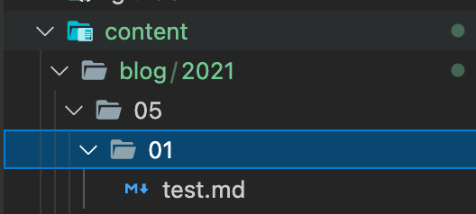

`content/blog/2021/05/01/test.md`は、2021年5月1日に作ったblogで、urlは`omomuro.dev/blog/test/`となります。

年月日の階層わけが一番わかりやすいかなあと思いました。

## Github Actionで、blogをS3にデプロイ 🐻

.github/workflows配下に下記のようなymlファイルを作っちゃいます。

```yml:title=s3-deploy.yml
name: deploy s3

on:
  push:
    branches:
      - main

jobs:
  build:
    runs-on: ubuntu-latest
    timeout-minutes: 5

    steps:
      - name: Checkout
        uses: actions/checkout@v2

      - name: setup node
        uses: actions/setup-node@v1
        with:
          node-version: '12.x'

      - name: Configure AWS credentials
        uses: aws-actions/configure-aws-credentials@v1
        with:
          aws-access-key-id: ${{ secrets.AWS_ACCESS_KEY_ID }}
          aws-secret-access-key: ${{ secrets.AWS_SECRET_ACCESS_KEY }}
          aws-region: ap-northeast-1

      - name: install
        run: npm ci

      - name: format
        run: npm run format

      - name: build
        run: npm run build

      - name: deploy file to S3
        run: npm run deploy

      - name: CloudFront Cache Clear
        env:
          CLOUD_FRONT_DISTRIBUTIONS_ID: ${{ secrets.CLOUD_FRONT_DISTRIBUTIONS_ID }}
        run: |
          aws cloudfront create-invalidation --distribution-id $CLOUD_FRONT_DISTRIBUTIONS_ID --paths "/*"
```

そんで、githubのリポジトリの設定のsecretsというところで下記のように、
AWSの各種IDやらアクセスキーやらをセットしておきましょう。

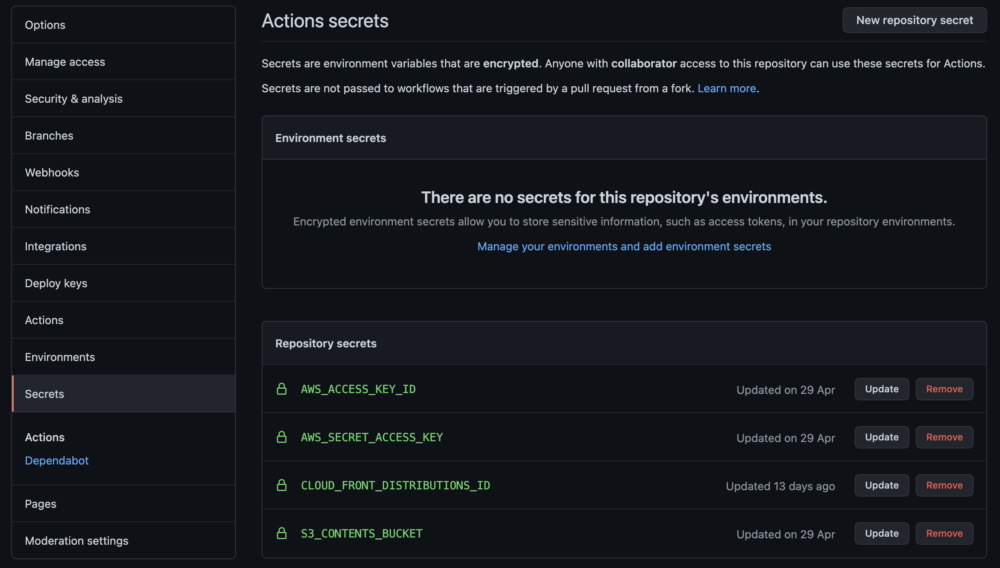

うまくいけば、githubにpushするたびに、下記が実行されることになります。

1. awsコマンドの設定
2. npm install
3. gatsby.jsのblogをbuildする
4. gastby.jsをs3にデプロイする(npm run deploy)
5. CloudFrontのキャッシュを全部クリアする

4番目のnpm run deployは、独自に定義したもので、中身としては
```
gatsby-plugin-s3 deploy --yes
```
です。

gatsby-plugin-s3プラグインを使う理由は、s3にアップロードする際に、キャッシュコントロールをよしなにいい感じに設定してアップしてくれるからです。

5番目のCloudFrontのキャッシュクリアは、CloudFrontのInvalidationを実行することで行っています。

## まとめ　📖

こうして振り返ってみると、色々やることはありましたが、１つ１つ理解していけば、そんなに難しくはないです。

少しのお金と時間で自分だけのブログを作成できますね！

レッツトライ！