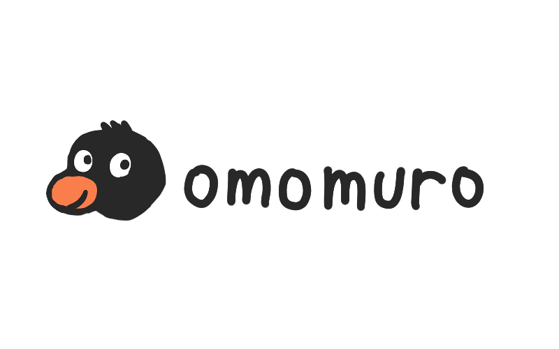
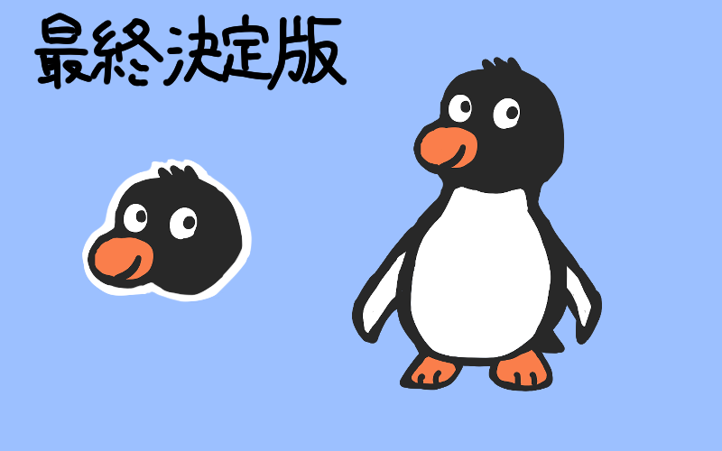
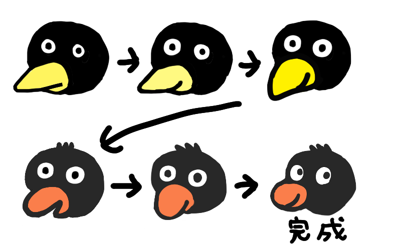
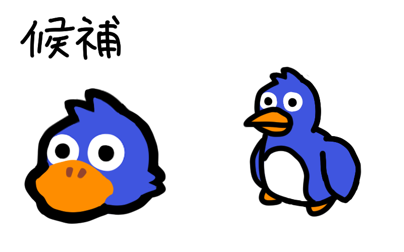
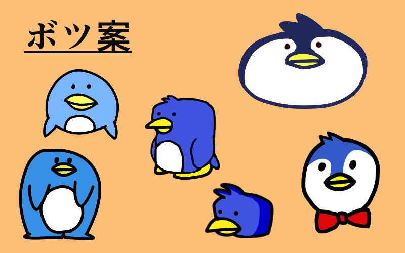
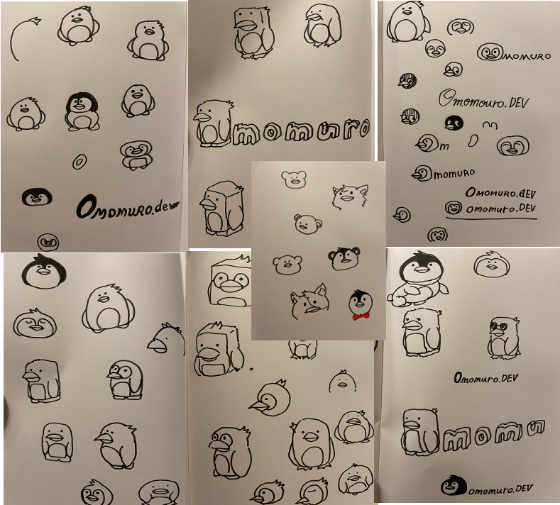

omomuro.devのイメージキャラクターを作らなければとずっと思っていました。
そして出来たのが上の絵です！

なんの動物か分かりますか？そうです！ペンギンです。かわいくないですか？？💘

約５日間悩みに悩んでこれになりました。

体も描いたバージョンはこちら。

どうでしょうか。。suicaペンギンでも、ピングーでもないし、ばつ丸くんでもないし、コウペンちゃん、ペンペン、その他の幾多のペンギンとは異なる新しいペンギンを提案できたのではないかと思います。

シンプルに寄っていくとsuicaペンギンやピングーがどうしてもちらついてきて、オリジナル感を出すのが難しいです。

これから下に紹介するのは、上の絵に至るまでに描いたボツ集となります。

## ボツ集

これは上のペンギンに至るまでの試行錯誤です。

矢印の変遷を経て完成版となりました。最初の方は、カラスみたいですよね。
顔の微妙なラインの違いで結構印象が変わります。あと目の形も地味に印象を変えます。

実は上記より前に、下図を最終盤として一時公開したんですが、見れば見るほどペンギンじゃなくてアヒルに見えるので、納得いかずボツにしました。（なぜペンギンにこだわっているのか自分でも謎ですが。）

ipadで清書する前に、ノートにペンで描いたラフなアイデア出しは下記みたいな感じです。
（これよりさらに何枚か描いてます。）

描いていくうちに、どんどん迷走していきまして、ペンギンと他の動物を混ぜたキメラができたりします。

これからはこの新しいomomuroペンギンさんともどもよろしくおねがいします🙇‍♂️